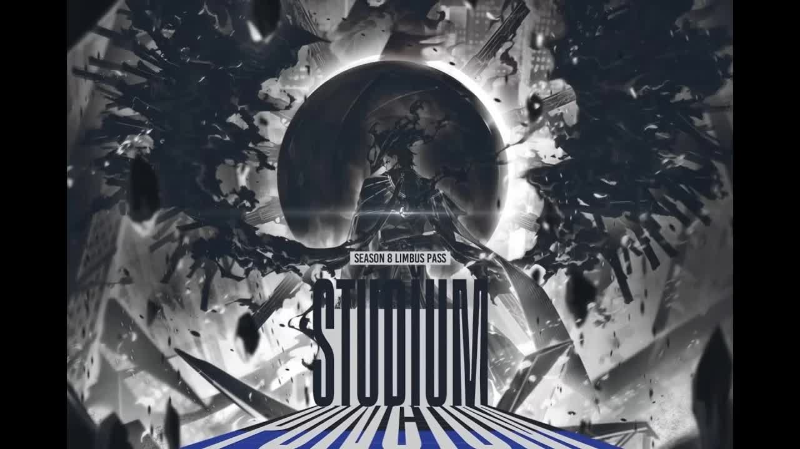

<div align="center">

# 🎬 LIVE FULL CANTO 10 PART 3 LET'S GOOOOOO LIMBUSSYYY

**Kênh: Kwan · Limbus Company — Canto X · Full Livestream**




</div>

---

## ▶️ XEM NGAY — KHÔNG CẦN TẢI VỀ MÁY

> [!TIP]
> **Bấm play là xem được ngay trong trình duyệt.** GitHub hỗ trợ phát video trực tiếp ngay trong repo — không cần download, không cần công cụ gì thêm.

### 🎥 PART 1/17 — Bắt đầu tại đây

https://raw.githubusercontent.com/chikago666/kwan-lmao-2/main/videos/part-01.mp4

[▶️ Link dạng 2: raw URL trong markdown link](https://raw.githubusercontent.com/chikago666/kwan-lmao-2/main/videos/part-01.mp4)

*👆 Bấm nút ▶ play ở giữa là xem được ngay — không cần tải về!*

---

## 📺 TOÀN BỘ PLAYLIST — 17 PARTS

Mỗi part là 1 file video độc lập, bấm vào là chạy player luôn. Thời gian dưới đây tính theo **vị trí trong livestream gốc** để bạn dễ tìm đoạn mình muốn xem.

| # | Trong livestream gốc | Thời lượng | Dung lượng | Xem ngay |
|:-:|:--|:--:|:--:|:--:|
| 01 | `0:00:00` → `0:31:49` | 31m49s | 86.9 MB | [▶ Mở player](videos/part-01.mp4) |
| 02 | `0:31:49` → `0:52:02` | 20m12s | 86.3 MB | [▶ Mở player](videos/part-02.mp4) |
| 03 | `0:52:02` → `1:17:19` | 25m17s | 86.9 MB | [▶ Mở player](videos/part-03.mp4) |
| 04 | `1:17:19` → `1:36:52` | 19m32s | 85.6 MB | [▶ Mở player](videos/part-04.mp4) |
| 05 | `1:36:52` → `1:53:50` | 16m58s | 85.9 MB | [▶ Mở player](videos/part-05.mp4) |
| 06 | `1:53:50` → `2:16:49` | 22m59s | 86.1 MB | [▶ Mở player](videos/part-06.mp4) |
| 07 | `2:16:49` → `2:41:11` | 24m21s | 86.7 MB | [▶ Mở player](videos/part-07.mp4) |
| 08 | `2:41:11` → `3:02:53` | 21m42s | 86.2 MB | [▶ Mở player](videos/part-08.mp4) |
| 09 | `3:02:53` → `3:22:35` | 19m42s | 86.5 MB | [▶ Mở player](videos/part-09.mp4) |
| 10 | `3:22:35` → `3:40:24` | 17m48s | 85.6 MB | [▶ Mở player](videos/part-10.mp4) |
| 11 | `3:40:24` → `3:57:52` | 17m28s | 86.3 MB | [▶ Mở player](videos/part-11.mp4) |
| 12 | `3:57:52` → `4:27:04` | 29m11s | 86.7 MB | [▶ Mở player](videos/part-12.mp4) |
| 13 | `4:27:04` → `4:53:43` | 26m39s | 86.1 MB | [▶ Mở player](videos/part-13.mp4) |
| 14 | `4:53:43` → `5:18:45` | 25m02s | 86.5 MB | [▶ Mở player](videos/part-14.mp4) |
| 15 | `5:18:45` → `5:37:05` | 18m19s | 86.5 MB | [▶ Mở player](videos/part-15.mp4) |
| 16 | `5:37:05` → `6:16:37` | 39m32s | 86.7 MB | [▶ Mở player](videos/part-16.mp4) |
| 17 | `6:16:37` → `6:41:04` | 24m27s | 63.6 MB | [▶ Mở player](videos/part-17.mp4) |

---

## ℹ️ Thông tin video

| | |
|:--|:--|
| **📺 Tiêu đề** | LIVE FULL CANTO 10 PART 3 LET'S GOOOOOO LIMBUSSYYY |
| **👤 Kênh** | Kwan (justkwanthings) |
| **🎮 Game** | Limbus Company — Canto X (Part 3) |
| **⏱ Thời lượng** | 6 giờ 41 phút 04 giây |
| **📅 Ngày đăng** | 01/10/2026 |
| **🎬 Định dạng** | MP4 · H.264 360p 30fps · AAC audio |
| **🔗 Nguồn gốc** | [youtube.com/live/bHLdm2GD3AY](https://www.youtube.com/live/bHLdm2GD3AY) |

---

## 📁 Cấu trúc repo

```
kwan-lmao-2/
├── README.md            ← Bạn đang ở đây
├── LICENSE
├── assets/
│   └── thumbnail.jpg    ← Thumbnail của livestream
└── videos/              ← Toàn bộ 17 part (bấm vào là xem)
    ├── part-01.mp4      ...  part-17.mp4
```

## ❓ Câu hỏi thường gặp

<details>
<summary><b>Tại sao chia thành 17 part?</b></summary>

GitHub giới hạn **mỗi file tối đa 100 MB** đối với repo thường. Livestream gốc dài hơn 6 tiếng 41 phút (~1.4 GB), nên buộc phải chia thành 17 part (mỗi part ~86 MB) để lưu trữ được. Các part được cắt tại keyframe nên việc chuyển part khi xem rất mượt, không mất giây nào của nội dung.

</details>

<details>
<summary><b>Xem có mượt không? Có cần tải về không?</b></summary>

Hoàn toàn KHÔNG cần tải về. Các file đã được tối ưu `faststart` (moov atom đặt ở đầu file) nên video bắt đầu phát gần như tức thì khi bấm play. Tất cả 17 part ghép lại chính xác = livestream gốc, không thiếu giây nào.

</details>

<details>
<summary><b>Tôi muốn tải về máy?</b></summary>

Vẫn được — vào thư mục [`videos/`](videos/), bấm vào part cần tải, chọn ⬇ **Download raw file**. Tải đủ 17 part rồi nối lại bằng công cụ bất kỳ (hoặc xem lần lượt).

</details>

---

<div align="center">

**⚖️ Lưu ý:** Video gốc thuộc bản quyền của kênh **Kwan**. Repo này chỉ nhằm mục đích **lưu trữ & xem lại**, không nhằm mục đích thương mại.

⭐ Nếu thấy hữu ích, cho repo một star nhé! ⭐

*Made with ❤️ for the Kwan community*

</div>
